# 試合戦術

---

## 90030_shiai_sakusen（作戦ボードテンプレート）

> 出典: Googleスライド「90030_shiai_sakusen」

ハンディー作戦ボードのテンプレートファイル。フォーメーション図を背番号アイコンの移動で構成するもの。

使い方
- フォーメーションは、背番号アイコンを移動させてつくることができます。
- 背番号アイコンを移動させるには、数字を指でタップし、選択された状態でスワイプさせます。

テンプレート内のアイコン例（スライド上のアイコン番号）

11人構成フォーマット:
❶ ❷ ❸ ❹ ❺ ❻ ❼ ❽ ❾ ❿ ⓫（両チーム分）

5人構成フォーマット:
❶ ❷ ❸ ❹ ❺（両チーム分）

6人構成フォーマット:
❶ ❷ ❸ ❹ ❺ ❻（両チーム分）

9人構成フォーマット:
❶ ❷ ❸ ❹ ❺ ❻ ❼ ❽ ❾（両チーム分）

※テキスト取得は一部のみ（作戦ボードの図解スライドはアイコン番号のみ取得可能。図解の詳細は原本参照）

---

## 2022/12/26 練習試合戦術

> 出典: Googleスライド「2022/12/26 練習試合戦術」

※テキスト取得は一部のみ（大容量60MBプレゼンのため。図解スライドの詳細は原本参照）

### 選手B / 選手D（選手C）

PnR連携

1. PnR仕掛ける
2. 成功したらRim attack
3. Overされたら
4. Repickから
5. Pull up
6. SwitchされたらDive
7. High postからのEntry
8. Hand offを狙う
9. もう一枚のPostはスペース空ける
10. Passerのマークが遅れたらポストマンのRim attackかHand offからのPull up
11. マークがDropしたらポストマンがPull up
12. Helpに出たらRim attack
13. Close outしてきたらHand offからのPull up
14. Defense rotationしてきたら、Hand offからKick off
15. Popを前提としたPnRのEntry
16. Underの場合、HandlerのAttackに合わせてScreenerはPop
17. Gapが生まれたら3P
18. High postからのEntry時、PasserへのBumpが上手かった場合はMiddle方向でのHand offからのPull up

### 選手C

PnRからのスリー

1. PnRからEntry
2. Underなら3P
3. OverならRipick
4. Pull upで3P

### 選手A

Isolation起点

1. IsolationからEntry
2. Rim attack（Line）
3. TopとWingでOff ball screen
4. 状況によってRim attack、Kick outを選択
5. Rim attack（Middle）
6. High postはSpaceを空ける
7. Week sideの0-positionからDeep cut
8. 状況によってPull up、Kick out、Assist passを選択

### 選手G

Two guard Entry

1. Two guardにてEntry
2. V-cutで受けると同時に、PnR
3. Rim attack（Line）
4. ScreenerはPop
5. Overされた場合、Dive
6. Underの場合はPull up
7. OverでDiveがBumpされた場合、0-PositionへのOff-ball screen
8. Switchの場合、ScreenerはPopしつつUCLA-cutを試みる
9. Popからの3PかUCLA-cutからのPull upが選択出来る

---

## 20221226_練習試合

> 出典: Googleスライド「20221226_練習試合」

※テキスト取得不可（ファイルのテキスト情報が空。図解のみの構成か、別フォーマットの可能性あり。原本参照）

---

## 2023/02/10 B支部大会戦術

> 出典: Googleスライド「2023/02/10 B支部大会戦術」

※コート図（SLOB／BLOB／Spain Pick／1-3-1ゾーンの配置と動き）は散文＋ページ画像で取り込み済み（各セクションに図を掲載。実名は画像内もマスク済み）。

### SLOB（Side Line Out of Bounds）

コンセプト
いつもの得意なPnRを仕掛ける状態をすぐに作る

手順
1. スタート
2. Down Screen & Pop outし、Throw-in
3. Throw-in 後、Dribble Hand offとPnRを同時に仕掛ける
4. 通常のPnR仕掛ける。ウイングはスペース空ける
5. Throw-in 時、Cornerから3Pを狙ってもOK

図の解説（コート配置と動きの経路）
- スロー員は選手B（背番号84）がサイドライン外からボールを入れる。インバウンド前は選手C（背番号92）と選手A（背番号22）がボールに近いローエリアでスタック、選手D（背番号9）は左エルボー、選手E（背番号71）は逆サイド上に開く。
- ②: 選手C（92）がダウンスクリーンをかけ、選手A（22）がポップアウトしてスローインを受ける。
- ③④: 受けた選手A（22）と選手D（9）がドリブルハンドオフ＋PnRを同時に仕掛け、そのままリングへアタック。逆サイドのウイングはスペースを空ける。
- ⑤の別解: スローインの瞬間、コーナーの選手C（92）へ直接入れて3Pを狙ってもよい。

**コート図**（背番号は保持／実名は黒塗り。原本: Googleスライド）

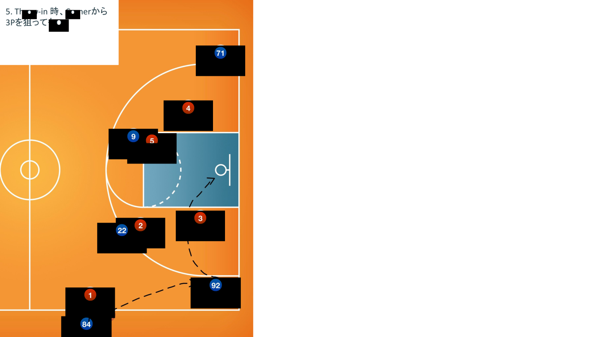

### BLOB（Base Line Out of Bounds）

コンセプト
- Curl cutでゴール下一発を狙う
- それがダメなら、Elevator screenによって、確実に3Pを狙う
- それがダメなら、Weak sideで1 on 1仕掛ける

手順
1. スタート
2. Curl CutしてRim attackを狙う
3. Rim attackかCatch & Shootを狙う
4. Attackできなかったらスペースを調整
5. Elevator screen、Catch & 3P
6. Throw-in後、Topでボールをもらう
7. Weak sideからAtack

図の解説（コート配置と動きの経路）
- スロー員は選手B（背番号84）がエンドライン外（リング右下）からボールを入れる。残り4人はゴール下にボックス気味でスタック。
- ②③: スタックから一人がCurl Cutでゴール下へ走り込み、リムアタックかキャッチ＆シュートを狙う。
- ④: 決まらなければ選手C（背番号92）がゴール下へカール、選手A（背番号22）はコーナーへ動いてスペースを再配置。
- ⑤: 二枚のスクリーナーがエレベータースクリーン（門）を作り、シューターがその間を通り抜けて逆ウイングで3P。
- ⑥⑦: スローイン後は選手C（92）がトップでボールを受け、逆サイド（Weak side）で1 on 1を仕掛ける。

**コート図**（背番号は保持／実名は黒塗り。原本: Googleスライド）

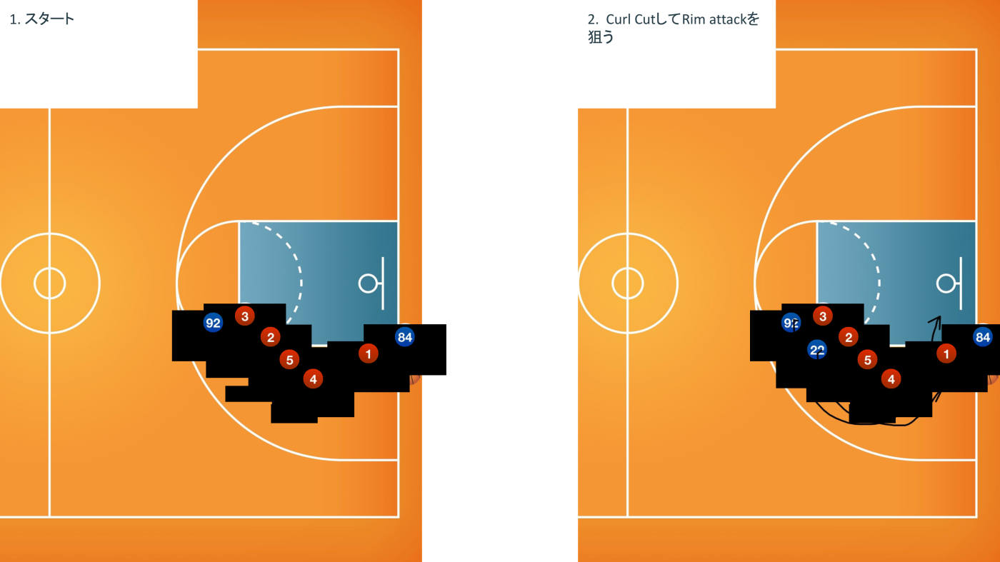

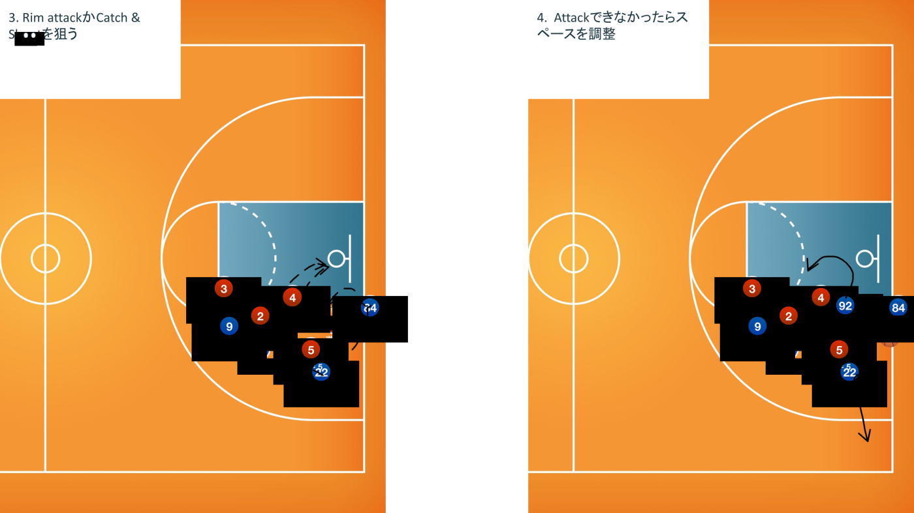

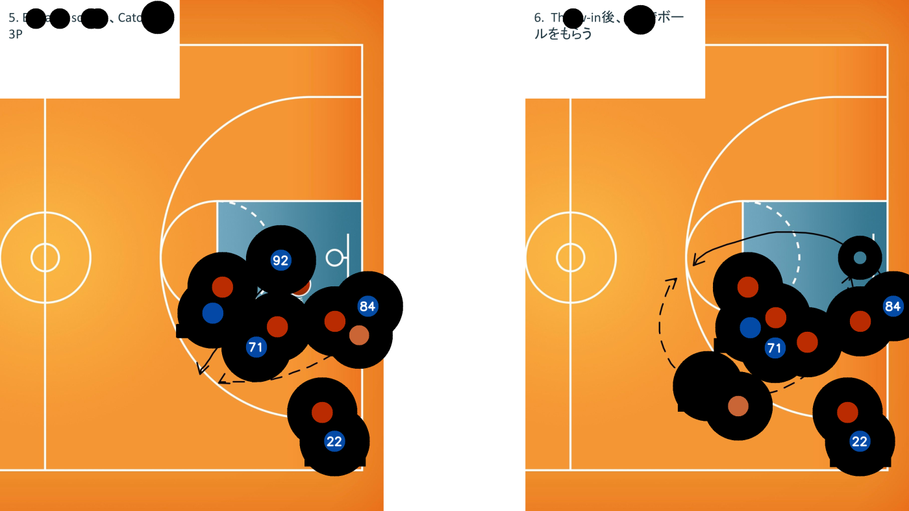

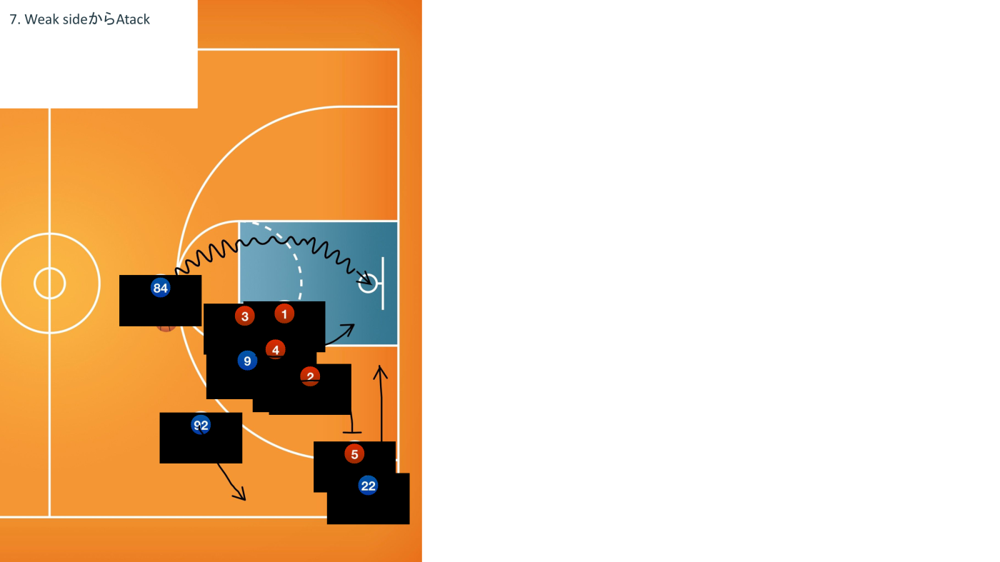

### Spain Pick（Double Screen Pop & Roll）

コンセプト
- PnRのDiveでのAttackの成功率を上げる
- Pop outからの3Pを狙いやすくする
- 実は何度でも同じ攻めをループ出来る

手順
1. スタート
2. PnRを仕掛けるが、Screenerに対してさらにScreenをかける
3. 1st ScreenerはDive、2nd ScreenerはPop
4. HandlerがAttackできればそのまま
5. DiverはScreenを利用してDive & Rim attack
6. ContainやSwitchなどでPaintを守られたら、Pop outして3P
7. 最初の形に戻ってる

図の解説（コート配置と動きの経路）
- スタート配置: ボールはトップ左で選手B（背番号84）が保持。選手D（背番号9）はボールサイドの左エルボー（ハイポスト脇）、選手C（背番号92）はストロングサイドのコーナー深め、選手A（背番号22）は逆サイドのウイング、選手E（背番号71）は逆サイドのコーナー上に開く。赤の選手1〜5はディフェンス。
- ダブルスクリーンの作り方: まず選手D（9）が選手B（84）のPnRにスクリーンをかける。続いて選手C（92）がコーナーから上がってきて、その選手D（9＝1stスクリナー）にもう一枚スクリーンをかける（これがSpain＝バックスクリーン）。
- 役割分担: 1stスクリナーの選手D（9）はスクリーン後すぐにリングへダイブ、2ndスクリナーの選手C（92）はトップ方向へポップ。
- フィニッシュの分岐: ハンドラー選手B（84）はそのままドライブ、もしくはダイブする選手D（9）へ合わせる。ペイントをContain/Switchで固められたら、ポップした選手C（92）へキックアウトして3P。決まらなければ最初の配置に戻して同じ攻めをループする。

**コート図**（背番号は保持／実名は黒塗り。原本: Googleスライド）

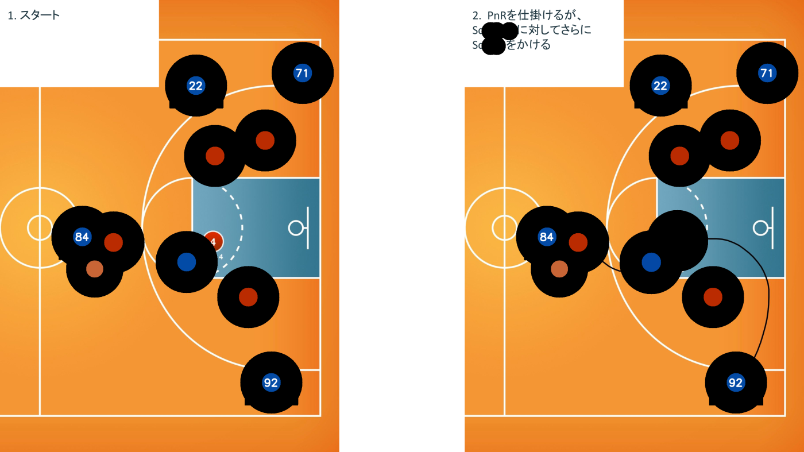

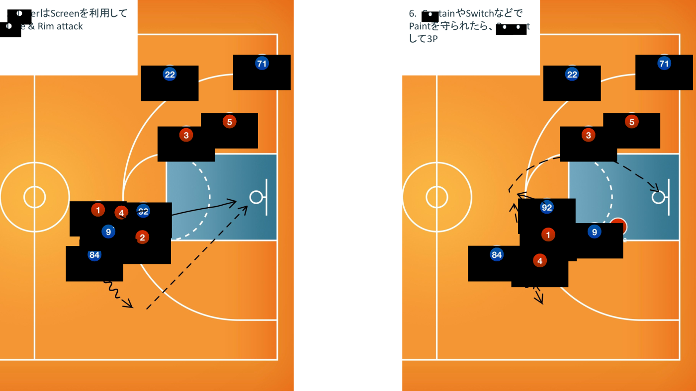

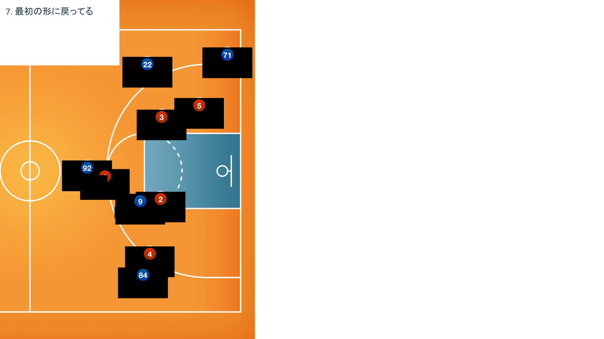

### 1-3-1 Zone Defense（※高校で使用した知識。中学はゾーン禁止＝試合では使用不可。参考・将来用）

陣形（守備側を x1〜x5、攻撃側を 1〜5 で表記。コート図はリングが上・ボールは下から運ばれる向き）
- x3 がトップ（最前列）でポイントの 1 にプレッシャー。x2（左）・x5（中央＝ナイル）・x4（右）が中段の3人。x1 が最後列でリング前を守り、ボールサイドのローポストはステイフロント（前を取る）。
- 攻撃側は 1 がトップ、2 が左ウイング、3 が右ウイング、4・5 がハイポスト〜ブロック付近。

ボールの位置ごとの動き
- トップ（1）からウイング（2）へパス: x3 がボールへ詰め、x2 と x3 がパスコースをデナイ。x5 はエルボーを埋め、x1 はボールサイドのローポストをステイフロント、x4 は逆サイドへドロップ。
- ウイング（2）でボール保持: すべてのパスコースをデナイ（deny every single pass course）。
- ミドルへドライブされたら: x5 がヘルプに出る。残りはキックアウトに備える。
- コーナーへボールが落ちたら: x1 がコーナーへ、x5 はボールサイドのブロックへドロップ、x2・x3 はパスコースをデナイ、x4 がリムをプロテクト。このときの見た目は 2-3 ゾーンに近くなる。
- サイドチェンジ（逆サイドへ展開）されたら: x3 がパスをデナイしつつ、図の通りローテーションして正しい位置へ入り直す。各自パスコースのデナイを徹底。
- ハイポストへフラッシュされたら: x5 が前に立ってデナイ。
- ハイポストでボールを持たれたら: x5 がボールマン、x1 はヘルプ準備、残りはキックアウトに備える。
- ローポストでボールを持たれたら: x1 と x5 でボールをトラップしてキックアウトさせる。残りはキックアウトに備える。

**コート図**（背番号は保持／実名は黒塗り。原本: Googleスライド）

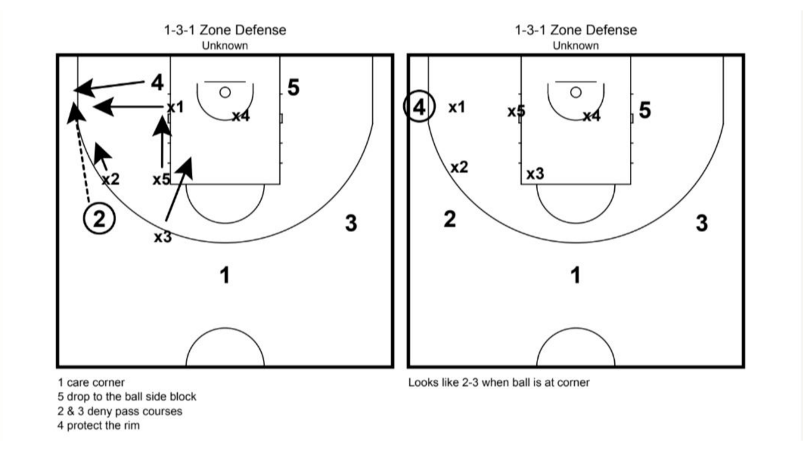

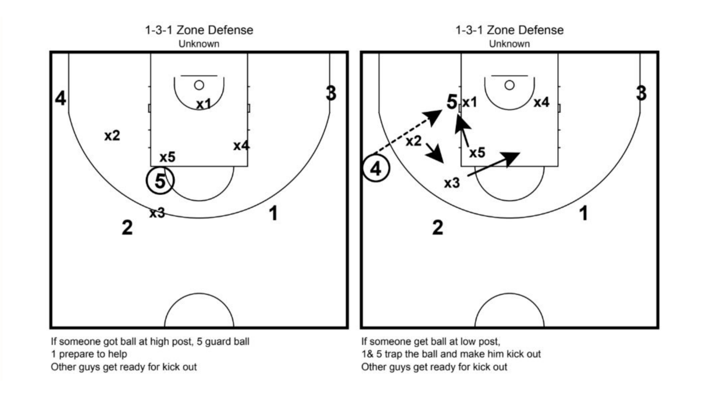

### Scouting by 相手校（相手校スカウティング）

Key Player
- 00番: Rim attackが上手い、ペネトレイト仕掛けてくる、アシストも狙える、リバウンドも強い
- 23番 / 24番: ゴールした

Tactics
- オフェンスはポストインからはじめる
- 身長差があるので、BumpしてそもそもSealさせない
- キックアウトはあまりないので、ボールが入ってしまったら近い二人で詰める
- スリーは25番が一本、00番が一本。そんなに気にしなくても良い
- ディフェンスは広くはじめる2-3ゾーン、ペネトレイト時に収縮
- Front coat entryと同時に攻める
- Entryした瞬間ならPnRは狙える
- Top、Wingから隙間を狙ってAttack
- Post upはFlashで
- Side changeを多めにする

---

## 2023/04/09 春季大会戦術

> 出典: Googleスライド「2023/04/09 春期大会戦術」

### Entry

コンセプト
- Early Entryで相手のディフェンスの隙を突く
- 二の矢でHalf coat basketを行う

概要

リバウンドを取ったケース:
- 選手Aが取った場合
  - そのままcoast to coastを狙う
  - DFが3人以上戻っていた場合、ゴールギリギリまで運んで後続の選手C（選手B）に戻す
  - DFが2人以内であれば問答無用でAttack
- 選手A以外が取った場合
  - 選手AがHand off気味にボールを受け取りに行く
  - 以下、リバウンド取ったケースのⅱ.と同様

得点を決められたケース:
- 選手D（選手C）がEnd lineからボールを出す
- 以降、リバウンドを取ったケース - 選手A以外の場合と同様

### Offence

コンセプト
- Early offenceを第1の矢とする
- 第2の矢はPost up or Out range shoot
- High postとTopの組み合わせ
- Flashを多用
- 第3の矢としてPnR（相手がマンツーだったら）
- メッチャ早撃ちすることでオフェンス機会を増やす

### Zone Attack

図の解説（コート配置と動きの経路）
- スタート配置: ボールはトップ左で選手C（背番号92）が保持。選手A（背番号22）は右の高い位置、選手E（背番号71）は右サイド、選手D（背番号9）は右ローエリア、選手B（背番号84）は逆サイド下に開く。赤の選手1〜5はディフェンス。
- ハイポストへのFlash: 選手D（9）がフリースローライン付近のハイポストへフラッシュし、選手C（92）からパスを受ける。
- ハイポストからの3択: ①選手D（9）が自らドライブでリムアタック、②ゴール下のポスト（選手E〈背番号71〉）へ落とすHigh-Low、③ポップアウトした選手C（92）へキックアウト。これに合わせて選手B（背番号84）が下から上がってシュートチャンスを作る。

**コート図**（背番号は保持／実名は黒塗り。原本: Googleスライド）

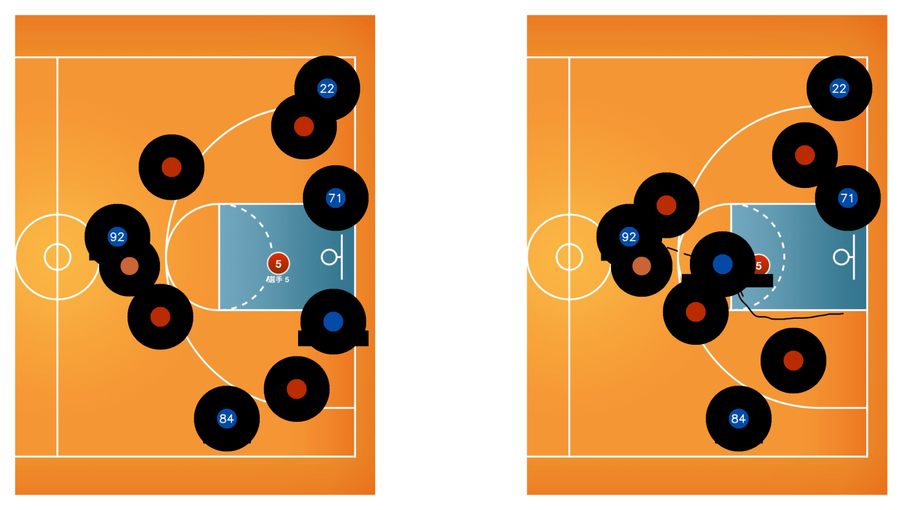

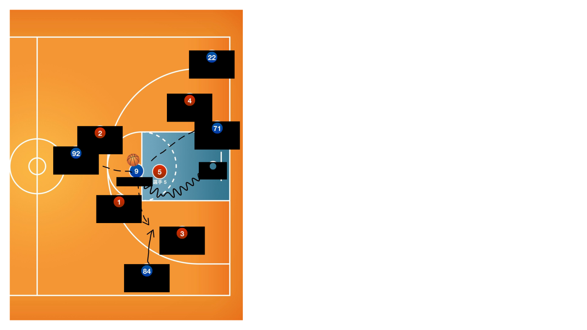

### 1-3-1 Zone Defense（※高校で使用した知識。中学はゾーン禁止＝試合では使用不可。参考・将来用）

陣形（守備側を x1〜x5、攻撃側を 1〜5 で表記。コート図はリングが上・ボールは下から運ばれる向き）
- x3 がトップ（最前列）でポイントの 1 にプレッシャー。x2（左）・x5（中央＝ナイル）・x4（右）が中段の3人。x1 が最後列でリング前を守り、ボールサイドのローポストはステイフロント（前を取る）。
- 攻撃側は 1 がトップ、2 が左ウイング、3 が右ウイング、4・5 がハイポスト〜ブロック付近。

ボールの位置ごとの動き
- トップ（1）からウイング（2）へパス: x3 がボールへ詰め、x2 と x3 がパスコースをデナイ。x5 はエルボーを埋め、x1 はボールサイドのローポストをステイフロント、x4 は逆サイドへドロップ。
- ウイング（2）でボール保持: すべてのパスコースをデナイ（deny every single pass course）。
- ミドルへドライブされたら: x5 がヘルプに出る。残りはキックアウトに備える。
- コーナーへボールが落ちたら: x1 がコーナーへ、x5 はボールサイドのブロックへドロップ、x2・x3 はパスコースをデナイ、x4 がリムをプロテクト。このときの見た目は 2-3 ゾーンに近くなる。
- サイドチェンジ（逆サイドへ展開）されたら: x3 がパスをデナイしつつ、図の通りローテーションして正しい位置へ入り直す。各自パスコースのデナイを徹底。
- ハイポストへフラッシュされたら: x5 が前に立ってデナイ。
- ハイポストでボールを持たれたら: x5 がボールマン、x1 はヘルプ準備、残りはキックアウトに備える。
- ローポストでボールを持たれたら: x1 と x5 でボールをトラップしてキックアウトさせる。残りはキックアウトに備える。

**コート図**（背番号は保持／実名は黒塗り。原本: Googleスライド）

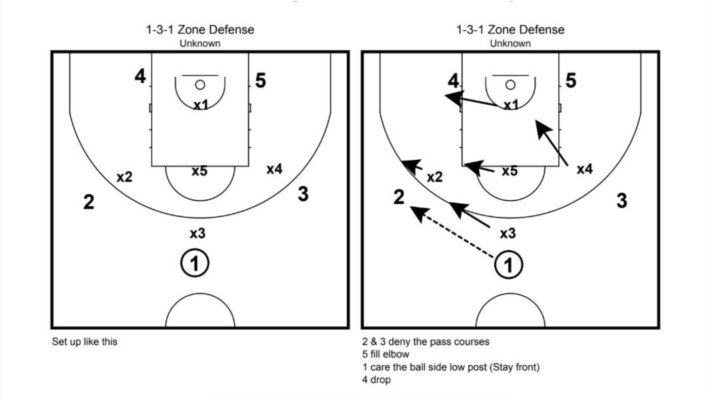

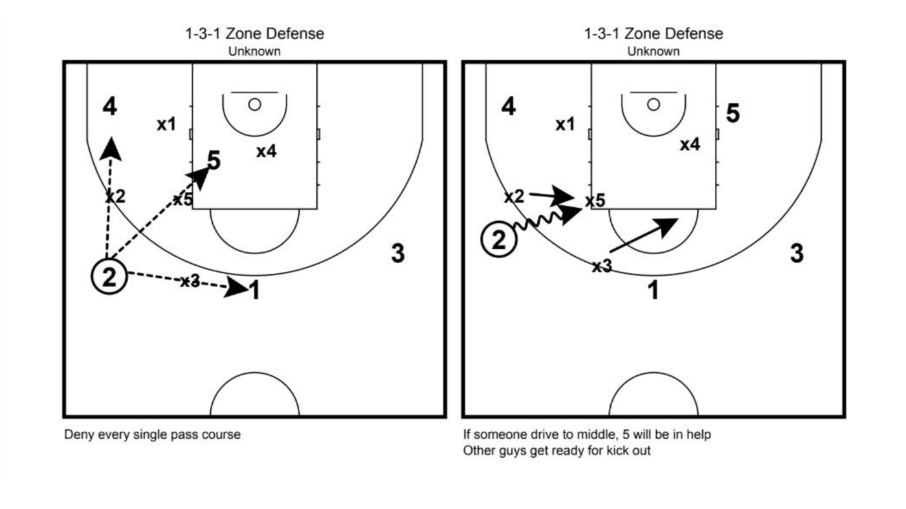

---

## 2023/05/04 総体予選戦術

> 出典: Googleスライド「2023/05/14（仮）総体予選戦術」

※コート図（Spain Pick／Zone Attack／SLOB／BLOB／1-3-1ゾーンの配置と動き）は散文＋ページ画像で取り込み済み（各セクションに図を掲載。実名は画像内もマスク済み）。

### Summary（いままでの総決算）

Entry
- 選手A - AttackからのEarly entry

Offence
- PnR（One-on-one Defense）
- High post entry（Zone Defense）
- SLOB
- ELOB

Defense
- 1-3-1 Zone Defense
- 2-1-2 Zone Defense

### Entry

コンセプト
- Early Entryで相手のディフェンスの隙を突く
- 万が一プレスかけられてもスピードでなんとかする
- 二の矢でHalf coat basketを行う

概要

リバウンドを取ったケース:
- 選手Aが取った場合
  - そのままcoast to coastを狙う
  - DFが3人以上戻っていた場合、ゴールギリギリまで運んで後続の選手C（選手B）に戻す
  - DFが2人以内であれば問答無用でAttack
- 選手A以外が取った場合
  - 選手AがHand off気味にボールを受け取りに行く
  - 以下、リバウンド取ったケースのⅱ.と同様

得点を決められたケース:
- 選手D（選手C）がEnd lineからボールを出す
- 以降、リバウンドを取ったケース - 選手A以外の場合と同様

### Offence - Spain Pick（Double Screen Pop & Roll）

コンセプト
- PnRのDiveでのAttackの成功率を上げる
- Pop outからの3Pを狙いやすくする
- 実は何度でも同じ攻めをループ出来る

手順
1. スタート
2. PnRを仕掛けるが、Screenerに対してさらにScreenをかける
3. 1st ScreenerはDive、2nd ScreenerはPop
4. HandlerがAttackできればそのまま
5. DiverはScreenを利用してDive & Rim attack
6. ContainやSwitchなどでPaintを守られたら、Pop outして3P
7. 最初の形に戻ってる

組み合わせ例

| ポジション | 担当選手 |
|---|---|
| Top | 選手B / 選手C / 選手G |
| Week side Wing (30°) | 選手E / 選手G / 選手A |
| Corner | 選手A / 選手C / 選手G / 選手B / 選手H |
| Post | 選手D / 選手E / 選手F |

注意事項
- 十分に高い位置からスタートする
- Wingは上がりすぎず、Topに十分なスペースを与える
- WingおよびCornerは、PickのタイミングでVカットなどで中央にスペースを作る
- Handlerはドリブルをやめない。PickかからなければRetreatしてスペースを広げ、Ripickを要求する

図の解説（コート配置と動きの経路）
- スタート配置: ボールはトップ左で選手B（背番号84）が保持。選手D（背番号9）はボールサイドの左エルボー（ハイポスト脇）、選手C（背番号92）はストロングサイドのコーナー深め、選手A（背番号22）は逆サイドのウイング、選手E（背番号71）は逆サイドのコーナー上に開く。赤の選手1〜5はディフェンス。
- ダブルスクリーンの作り方: まず選手D（9）が選手B（84）のPnRにスクリーンをかける。続いて選手C（92）がコーナーから上がってきて、その選手D（9＝1stスクリナー）にもう一枚スクリーンをかける（これがSpain＝バックスクリーン）。
- 役割分担: 1stスクリナーの選手D（9）はスクリーン後すぐにリングへダイブ、2ndスクリナーの選手C（92）はトップ方向へポップ。
- フィニッシュの分岐: ハンドラー選手B（84）はそのままドライブ、もしくはダイブする選手D（9）へ合わせる。ペイントをContain/Switchで固められたら、ポップした選手C（92）へキックアウトして3P。決まらなければ最初の配置に戻して同じ攻めをループする。

**コート図**（背番号は保持／実名は黒塗り。原本: Googleスライド）

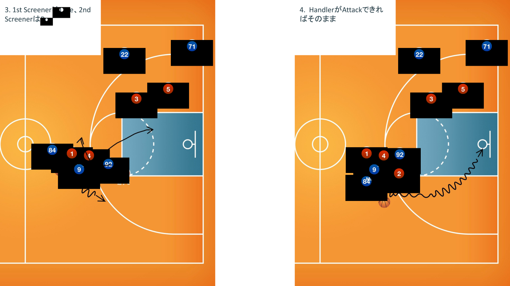

### Zone Attack

コンセプト
- Post up or Out range shoot
- High postとTopの組み合わせ
- Flashを多用
- FlashからのPost inと同じタイミングで、Sideは0°にむけたV-Cutをする

手順
1. End lineに4人並んだ状態でスタート
2. Low postからHigh postにFlashする
3. 以下から選択:
   - 自らAttack
   - High - Low
   - Pop out

組み合わせ例

| ポジション | 担当選手 |
|---|---|
| Top | 選手C / 選手B / 選手G |
| Side | 選手A / 選手G / 選手B / 選手H / 選手C |
| Post | 選手D / 選手E / 選手F / 選手G |

注意事項
- Post upの際は面を取らない。0.5秒待ってボールが入らなければ、もう一枚のPostとローテーションする
- Flash時Ball in出来たら、まずはゴールに向かって正対する

図の解説（コート配置と動きの経路）
- スタート配置: エンドライン沿いに4人が横並び。ボールはトップ左で選手C（背番号92）が保持。赤の選手1〜5はディフェンス。
- ハイポストへのFlash: ローポストにいた選手D（背番号9）がフリースローライン付近のハイポストへフラッシュし、選手C（92）からパスを受ける。
- ハイポストからの3択: ①選手D（9）が自らアタック、②ゴール下のポスト（選手E〈背番号71〉）へ落とすHigh-Low、③守りが収縮したらポップアウトしてアウトサイドへキックアウト。これに合わせて選手A（背番号22）はトップへ上がり、選手C（92）は左ウイングへ開き、選手B（背番号84）はコーナーから上がってシュートチャンスを作る。

**コート図**（背番号は保持／実名は黒塗り。原本: Googleスライド）

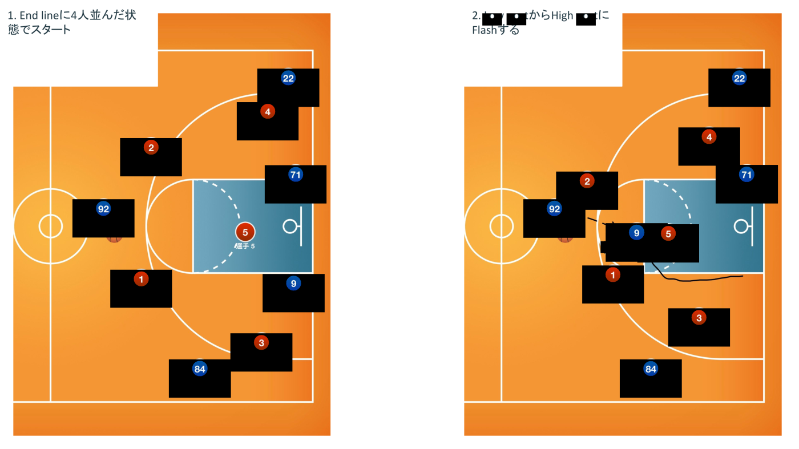

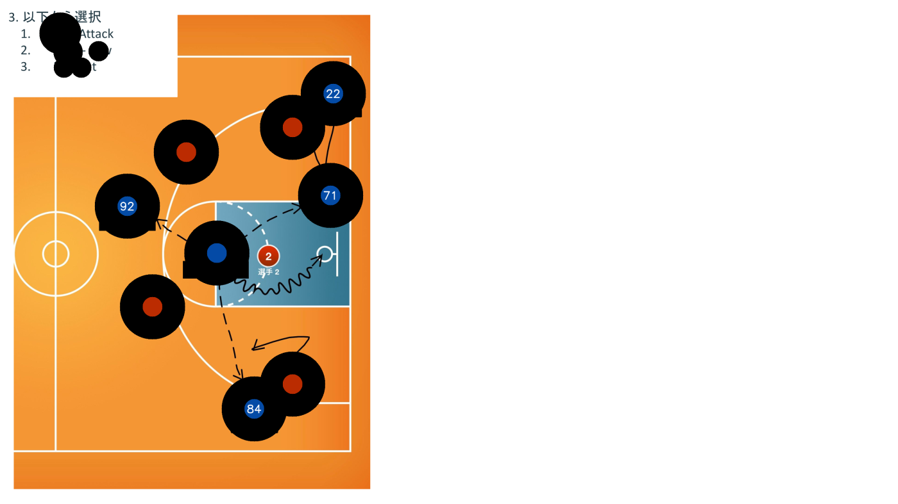

### Entry - SLOB（Side Line Out of Bounds）

コンセプト
いつもの得意なPnRを仕掛ける状態をすぐに作る

手順
1. スタート
2. Down Screen & Pop outし、Throw-in
3. Throw-in 後、Dribble Hand offとPnRを同時に仕掛ける
4. 通常のPnR仕掛ける。ウイングはスペース空ける
5. Throw-in 時、Cornerから3Pを狙ってもOK

図の解説（コート配置と動きの経路）
- スロー員は選手B（背番号84）がサイドライン外からボールを入れる。インバウンド前は選手C（背番号92）と選手A（背番号22）がボールに近いローエリアでスタック、選手D（背番号9）は左エルボー、選手E（背番号71）は逆サイド上に開く。
- ②: 選手C（92）がダウンスクリーンをかけ、選手A（22）がポップアウトしてスローインを受ける。
- ③④: 受けた選手A（22）と選手D（9）がドリブルハンドオフ＋PnRを同時に仕掛け、そのままリングへアタック。逆サイドのウイングはスペースを空ける。
- ⑤の別解: スローインの瞬間、コーナーの選手C（92）へ直接入れて3Pを狙ってもよい。

**コート図**（背番号は保持／実名は黒塗り。原本: Googleスライド）

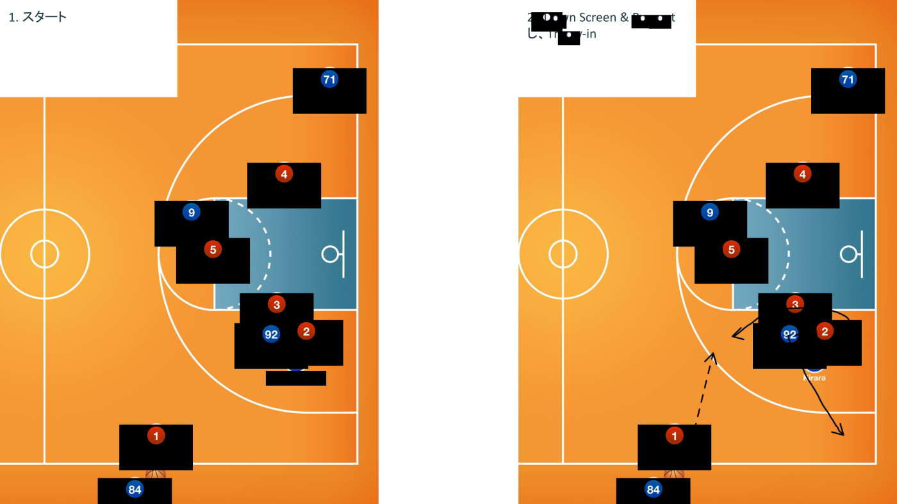

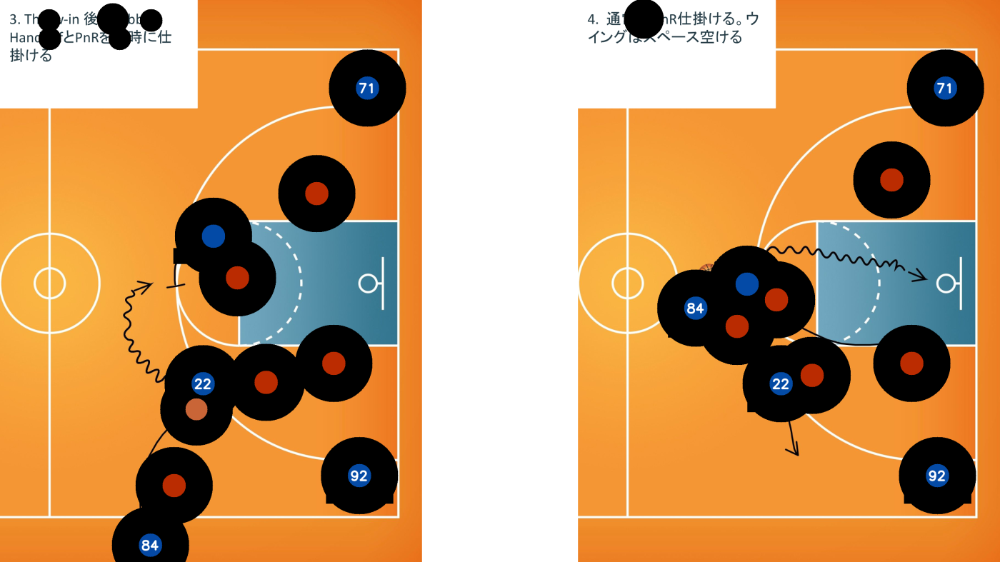

### BLOB（Base Line Out of Bounds）

コンセプト
- Curl cutでゴール下一発を狙う
- それがダメなら、Elevator screenによって、確実に3Pを狙う
- それがダメなら、Weak sideで1 on 1仕掛ける

手順
1. スタート
2. Curl CutしてRim attackを狙う
3. Rim attackかCatch & Shootを狙う
4. Attackできなかったらスペースを調整
5. Elevator screen、Catch & 3P
6. Throw-in後、Topでボールをもらう
7. Weak sideからAtack

図の解説（コート配置と動きの経路）
- スロー員は選手B（背番号84）がエンドライン外（リング右下）からボールを入れる。残り4人はゴール下にボックス気味でスタック。
- ②③: スタックから一人がCurl Cutでゴール下へ走り込み、リムアタックかキャッチ＆シュートを狙う。
- ④: 決まらなければ選手C（背番号92）がゴール下へカール、選手A（背番号22）はコーナーへ動いてスペースを再配置。
- ⑤: 二枚のスクリーナーがエレベータースクリーン（門）を作り、シューターがその間を通り抜けて逆ウイングで3P。
- ⑥⑦: スローイン後は選手C（92）がトップでボールを受け、逆サイド（Weak side）で1 on 1を仕掛ける。

**コート図**（背番号は保持／実名は黒塗り。原本: Googleスライド）

### 1-3-1 Zone Defense（※高校で使用した知識。中学はゾーン禁止＝試合では使用不可。参考・将来用）

陣形（守備側を x1〜x5、攻撃側を 1〜5 で表記。コート図はリングが上・ボールは下から運ばれる向き）
- x3 がトップ（最前列）でポイントの 1 にプレッシャー。x2（左）・x5（中央＝ナイル）・x4（右）が中段の3人。x1 が最後列でリング前を守り、ボールサイドのローポストはステイフロント（前を取る）。
- 攻撃側は 1 がトップ、2 が左ウイング、3 が右ウイング、4・5 がハイポスト〜ブロック付近。

ボールの位置ごとの動き
- トップ（1）からウイング（2）へパス: x3 がボールへ詰め、x2 と x3 がパスコースをデナイ。x5 はエルボーを埋め、x1 はボールサイドのローポストをステイフロント、x4 は逆サイドへドロップ。
- ウイング（2）でボール保持: すべてのパスコースをデナイ（deny every single pass course）。
- ミドルへドライブされたら: x5 がヘルプに出る。残りはキックアウトに備える。
- コーナーへボールが落ちたら: x1 がコーナーへ、x5 はボールサイドのブロックへドロップ、x2・x3 はパスコースをデナイ、x4 がリムをプロテクト。このときの見た目は 2-3 ゾーンに近くなる。
- サイドチェンジ（逆サイドへ展開）されたら: x3 がパスをデナイしつつ、図の通りローテーションして正しい位置へ入り直す。各自パスコースのデナイを徹底。
- ハイポストへフラッシュされたら: x5 が前に立ってデナイ。
- ハイポストでボールを持たれたら: x5 がボールマン、x1 はヘルプ準備、残りはキックアウトに備える。
- ローポストでボールを持たれたら: x1 と x5 でボールをトラップしてキックアウトさせる。残りはキックアウトに備える。

**コート図**（背番号は保持／実名は黒塗り。原本: Googleスライド）

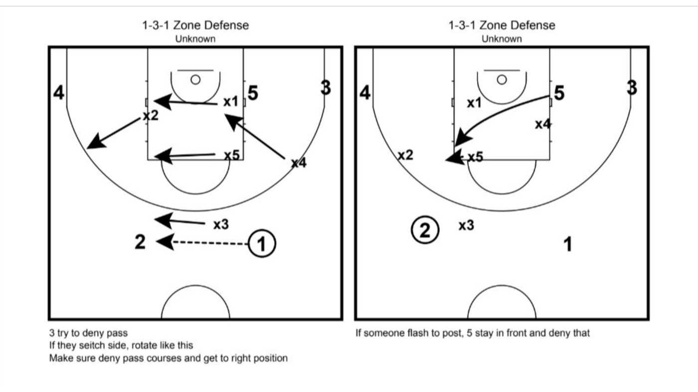

注意事項
- Offense→DefenseのTransition時、戻りを早くする。まずはフリースローライン目指して走る
- Defense Rebound時、一度ゾーンの範囲をぎゅっと狭めてみる
- Topから45°くらいまででボールを持たれた際は、マンツーと同じように守る
- CornerにボールがLotた場合は、便宜的に2−3のような形になる
- Rotationを考えてみる
